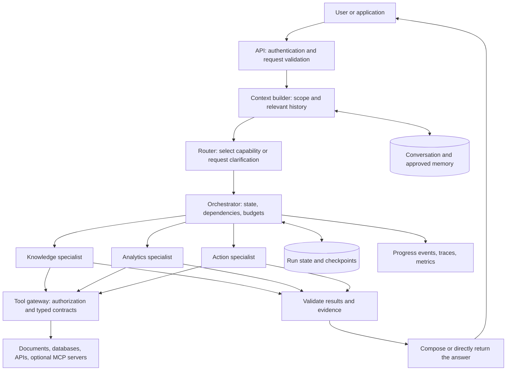

# Multi-Agent System Architecture

A reusable, high-level blueprint for building a new system efficiently.

Companion guide: [VLM_MULTI_CAMERA_TRACKING_ARCHITECTURE.md](VLM_MULTI_CAMERA_TRACKING_ARCHITECTURE.md).

## 1. Recommended Starting Point

Start with **one Router, one code-controlled orchestrator, a small specialist registry, and explicit tool APIs**. Run one specialist per request unless the task genuinely needs several. Add parallel work, dynamic planning, and evaluator loops only when evaluations demonstrate a benefit.

An agent is a model-driven worker that can choose actions and tools within a bounded task. A tool is a callable capability, not another agent. A workflow is a predefined sequence of operations. Several agents can share the same underlying model while using different instructions, tools, and context.

The core distinction is:

> The Router decides who should handle the request. The orchestrator controls how the work runs. Specialists do the work. Tools access or change the world. Validators decide whether the result satisfies the contract.

This guide is a recommended reference design, not a claim that every component is already implemented in this repository. Section 12 includes the repository mapping, proposed file structure, creation order, and runnable reference code. External sources are listed in Section 13.

## 2. System Structure



The specialist branches show available capabilities, not a requirement to invoke all agents. A simple request should take the shortest valid path.

Separate the **control plane** (routing, scheduling, permissions, budgets) from the **execution plane** (model calls and tool operations). They can initially live in one application; a logical boundary does not require a microservice.

## 3. Component Responsibilities

| Component | Owns | Should not own |
| --- | --- | --- |
| API layer | Authentication, request schema, tenant identity, run creation | Long-running model loops inside a web request |
| Context builder | Relevant history, explicit filters, source references | Unlimited transcript copying or treating summaries as authoritative facts |
| Router | Capability selection, clarification, unsupported requests | Executing tools or inventing permissions |
| Orchestrator | Task dependencies, state transitions, retries, cancellation, deadlines | Domain-specific SQL or retrieval logic |
| Specialist agent | A bounded domain task using approved tools | Unrestricted delegation or access to all tools |
| Tool gateway | Input validation, authorization, execution, audit records | Trusting a prompt to enforce security |
| Validator | Schema checks, evidence checks, business invariants | Assuming another model's agreement proves correctness |
| Answer composer | Presenting validated results and limitations | Inventing missing facts or concealing failed subtasks |
| State store | Durable run/task status and recovery information | Using a vector database as the transaction system |
| Observability | Correlated operational traces, cost, latency, failures | Logging credentials or unrestricted sensitive payloads |

Use a registry to describe each specialist: stable name, capability description, accepted schema, allowed tools, model configuration, output schema, timeout, and budget. Keep model-provider adapters separate from domain behavior.

## 4. Router Design

A Router should return a **structured routing decision**, not prose that the application has to interpret.

Recommended decision order:

1. Apply server-side permission and supported-scope checks.
2. Apply explicit workflow selections and tested rules for unambiguous requests.
3. Use a small classifier or LLM with structured output for the remaining cases.
4. Ask a targeted clarification when a missing fact would change the execution.
5. Return an explicit unsupported outcome when no registered capability fits.

Routing needs the current message **and relevant conversation state**. For example, "Which time range did you use?" should remain attached to the previous analytics result rather than become a generic question. Store pending clarification fields explicitly so short answers such as "yesterday" can complete the original request.

Illustrative contract, not a framework-specific API:

```json
{
  "schema_version": "1",
  "run_id": "run-1042",
  "outcome": "route",
  "capability": "analytics",
  "workflow": "single_specialist",
  "task": "Compare output between two specified shifts",
  "scope": {
    "site_id": "site-a",
    "timezone": "Asia/Ho_Chi_Minh",
    "start_utc": "2026-09-30T00:00:00Z",
    "end_utc": "2026-10-01T00:00:00Z"
  },
  "missing_fields": [],
  "reason_code": "structured_data_comparison"
}
```

Validate agent names against the registry. Treat model-proposed scope as a request: intersect it with permissions derived from the authenticated user. Do not accept model-generated user identities or access rights. Use half-open time intervals consistently: start inclusive, end exclusive.

Other outcomes should include `clarify` and `unsupported`. Model-reported confidence is not a calibrated probability; evaluate routing accuracy and abstention behavior on labeled examples instead of trusting a self-assigned score.

## 5. Orchestration Patterns

| Pattern | Use when | Main tradeoff |
| --- | --- | --- |
| Single specialist | One capability can complete the task | Best initial baseline; simplest to evaluate |
| Fixed sequential workflow | Later steps require earlier outputs | Predictable dependencies, cumulative latency |
| Parallel fan-out and join | Independent subtasks can use the same starting context | Lower wall time, higher concurrent cost |
| Dynamic planner plus workers | Needed subtasks cannot be known in advance | Flexible, but harder to bound and reproduce |
| Evaluator and revision loop | A clear rubric makes revision measurably useful | Extra latency and risk of unproductive loops |
| Handoff | A different specialist should own the next interaction | Requires explicit transfer of context and responsibility |

For a new product, prefer a **deterministic state machine around bounded agent behavior**. A model may propose a task graph, but code must validate the graph, enforce permissions, and schedule it. An orchestrator does not have to be an LLM.

Example request: "Explain yesterday's output drop and prepare a maintenance ticket."

1. Resolve site, equipment, time range, and ticket intent.
2. Fetch output metrics and maintenance records in parallel if independent.
3. Analyze the combined evidence after both retrieval tasks finish.
4. Retrieve relevant procedures based on the actual issue found.
5. Produce an explanation and a ticket draft, with uncertainty preserved.
6. Obtain required approval before creating the ticket through a write tool.

Do not run the analysis before its required evidence exists. Parallelism follows the dependency graph, not the number of available agents.

An LLM explanation can identify supported hypotheses; correlation between a maintenance event and an output drop is not proof of causation.

## 6. State, Memory, And Contracts

Keep these categories separate:

| Category | Contents | Typical storage |
| --- | --- | --- |
| Run state | Task graph, status, attempts, deadline, outputs, errors | Transactional database or persistent workflow checkpoints |
| Conversation memory | Recent turns, pending clarification, confirmed scope | Database with a bounded context window |
| Long-term memory | Approved preferences and durable facts with provenance | Scoped database records; optional semantic index |
| Knowledge | Documents, catalog metadata, relationships | Source systems plus optional vector or graph index |
| Artifacts | Reports, large tool results, exports | Object storage with references in run state |

Suggested run lifecycle:

```text
received -> validated -> routed -> running -> validating -> completed
                             running -> waiting_for_input -> running
                             running -> waiting_for_approval -> running
                             running -> partially_completed / failed / canceled
```

Each task should carry `task_id`, parent `run_id`, input references, dependencies, assigned capability, status, attempt count, deadline, and output references. Parallel workers return separate task results; the orchestrator merges them using an explicit rule instead of allowing uncontrolled shared-state writes.

A specialist result should include:

- `status`: success, needs clarification, partial, or failed.
- `data`: typed domain output, kept separate from presentation text.
- `evidence`: source IDs, tool-call IDs, query scope, retrieval time, and artifact references.
- `limitations`: unavailable inputs, ambiguity, and failed dependencies.
- `usage`: model identifier, prompt version, tool calls, latency, and cost counters.

Keep evidence accessible beyond any summary. Summaries are lossy navigation aids, not replacements for business facts. Apply retention and tenant boundaries to memory, indexes, caches, and checkpoints as well as to source data.

## 7. Tools And Security

Prefer narrow domain tools such as `get_shift_output` or `draft_maintenance_ticket` over unrestricted SQL, shell, or arbitrary HTTP access.

- Validate structured arguments and outputs at runtime, including ranges, identifiers, and maximum result size.
- Enforce access in the tool/service layer on every call. Prompts and tool allowlists are not substitutes for authorization.
- Separate read tools, draft operations, and committed writes. Bind approvals to the exact operation, arguments, user, and expiry.
- Treat retrieved documents, tool output, web content, and other agents' text as untrusted data that may contain prompt injection.
- Keep credentials out of prompts and transcripts. Use scoped service identities and approved outbound destinations.
- Give tools explicit timeout, retry, idempotency, and error semantics.
- Use MCP when shared tool discovery and interoperability help. MCP is a tool integration protocol, not the Router, scheduler, or security boundary by itself.

For MCP deployments, follow the protocol's authorization guidance: validate token audience, avoid token passthrough, minimize scopes, and do not treat a session ID as authentication. Sandbox local tool servers where possible.

## 8. Reliability And Recovery

**A queue is not a workflow engine, and a checkpoint is not an exactly-once guarantee.** A worker crash can occur after an external operation succeeds but before the result is persisted.

| Failure | Recommended behavior |
| --- | --- |
| Temporary network failure or rate limit | Bounded retries with backoff and jitter, within the original deadline |
| Invalid arguments or permission denial | Correct through the allowed workflow or stop; do not blindly retry |
| One optional parallel task fails | Return a labeled partial result if the task contract permits it |
| Required evidence is unavailable | Stop dependent tasks or request input rather than fabricate completion |
| Worker restarts | Recover from durable state and reconcile operations with unknown outcomes |
| User cancels | Stop scheduling work, signal active workers, and record any already-completed effects |
| Provider fails | Use an approved fallback only if it meets capability, privacy, and residency requirements |

Use idempotency keys and unique constraints for writes. If a write times out after submission, query its status before resubmitting. Avoid retrying an entire agent run when doing so could duplicate completed actions.

Persist run creation and reliable job dispatch using an outbox or equivalent mechanism when losing a job is unacceptable. Use worker leases or atomic claims to prevent concurrent ownership. Reauthorize resumed privileged operations and expire stale approvals.

Set limits on total duration, model calls, tokens, tool calls, delegation depth, parallel workers, and revision rounds. Define a stop condition before deployment. A fallback must not reset those limits.

## 9. Evaluation And Observability

Create a small representative evaluation set before adding more agents. Include normal requests, ambiguous requests, follow-ups, unsupported tasks, permission boundaries, failed tools, and repeated delivery.

| Layer | Measure |
| --- | --- |
| Router | Per-capability precision/recall, confusion matrix, clarification appropriateness |
| Specialist | Task success, valid tool arguments, correct scope, supported factual claims |
| Orchestrator | Dependency ordering, deadline enforcement, recovery, cancellation, duplicate effects |
| End-to-end | User task completion, evidence quality, partial-result honesty, cost per successful task |
| Operations | Queue delay, p50/p95 latency, provider errors, token use, retry count |
| Security | Cross-tenant isolation, unauthorized tool attempts, injection resistance, approval enforcement |

Trace `run_id -> task_id -> model/tool call -> evidence`. Record inputs and outputs only under an appropriate redaction and retention policy. User-facing progress should report operational events such as "retrieving records", not private model reasoning.

Use deterministic assertions for permissions, schemas, arithmetic, and database results. Use expert review and calibrated model-based grading for open-ended quality. Pin model, prompt, tool, and workflow versions so regressions can be traced.

## 10. Technology Choices

| Need | Practical starting choice |
| --- | --- |
| API and business integration | Keep an existing Django/FastAPI stack rather than introducing another framework |
| Small workflow | Plain application code with explicit state and typed contracts |
| Branching, checkpoints, resumable interaction | A graph runtime such as LangGraph with persistent checkpoints |
| Background jobs | Existing queue workers; Celery is an option in compatible deployments |
| Long-lived operational workflows | Evaluate a durable workflow engine if its recovery guarantees justify the complexity |
| State and artifacts | PostgreSQL plus object storage; add Redis only for a defined queue/cache role |
| Retrieval | Start with source queries; add vector retrieval or a knowledge graph for demonstrated query needs |

Choose one clear owner for workflow state. Avoid stacking multiple orchestration frameworks without a specific requirement. Check operating-system support, deployment constraints, model terms, and data handling before selecting packages or providers.

## 11. Efficient Build Order

1. Define a handful of concrete user tasks, forbidden actions, and measurable success criteria.
2. Build and test the underlying read-only tools without an LLM.
3. Implement one specialist with typed input/output and source evidence.
4. Establish a single-agent baseline for task success, cost, and latency.
5. Add a Router and a second specialist only where specialization helps that baseline.
6. Add durable run state, progress reporting, cancellation, budgets, and failure tests.
7. Introduce fixed multi-step workflows; parallelize only independent tasks.
8. Add writes behind approval and idempotency safeguards.
9. Add dynamic planning or evaluator loops only for measured gaps.
10. Roll out with a versioned evaluation gate, limited traffic, and rollback capability.

Organize modules around contracts, routing, orchestration, specialists, tools, state, and evaluation. Keep domain prompts and tool definitions together, while keeping provider configuration outside domain logic.

Avoid starting with a large team of named agents, a shared unlimited conversation, or an autonomous supervisor that can invent tools and permissions. Those choices increase coordination cost before proving value.

## 12. Mapping To This Repository

These observations are based on source inspection, not a runtime audit:

| Existing surface | Architectural lesson |
| --- | --- |
| [tegaf_home/teg_ai_agent/agents/router.py](../tegaf_home/teg_ai_agent/agents/router.py) | Defines routing/state contracts and `RouterOrchestrator`; loads conversation context and invokes the selected specialist |
| [tegaf_home/teg_ai_agent/agents/sub_agents.py](../tegaf_home/teg_ai_agent/agents/sub_agents.py) | Builds specialist agents, filters MCP tools, builds messages, and extracts results plus tool evidence |
| [tegaf_home/teg_ai_agent/tasks.py](../tegaf_home/teg_ai_agent/tasks.py) | Connects agent execution to background jobs, progress updates, and run lifecycle handling |

The current orchestrator takes the **first selected classification** and directly invokes that specialist. Its asynchronous task streams progress; it is not a parallel multi-specialist fan-out. The available specialist names include `general_agent`, `technician_expert_agent`, `analytics_agent`, and `tool_agent`.

Reuse the separation of routing, specialist behavior, tool access, and persisted progress. Treat task graphs, cross-agent result merging, durable per-step recovery, and approval policies in this guide as design requirements to implement or verify, not existing guarantees.

### 12.1. Proposed File Structure And Responsibilities

This is a **target layout inside the existing Django project**, not a claim that the proposed files exist. Only this guide is being updated. For a new project, use the same boundaries with your own project and app names.

- `[E]`: existing file or directory to reuse or extend. Its description below is the intended responsibility, not a guarantee of current behavior.
- `[N]`: proposed new file for the initial read-only design. Create these incrementally using Section 12.3.
- `[L]`: later addition, needed only when introducing its associated capability.

Every listed file has its role beside it. Unrelated application files are omitted. Add an empty `__init__.py` to every new Python package, including test packages; these files mark importable packages and should not start workers or perform network calls.

```text
nuvia_shared/
|-- README.md                            [E] Setup, commands, and architecture links.
|-- requirements.txt                     [E] Direct application dependencies.
|-- requirements.lock.txt                [E] Pinned versions for reproducible environments.
|-- docs/
|   `-- MULTI_AGENT_SYSTEM_ARCHITECTURE.md [E] Architecture, file ownership, and reference code.
|-- mcp_server/
|   |-- server.py                        [E] Optional MCP transport exposing approved tools.
|   `-- test_connection.py               [E] MCP connectivity smoke check, not security coverage.
|-- tegaf_home/
|   |-- manage.py                        [E] Django management entry point.
|   |-- pytest.ini                       [E] Test discovery and Django test configuration.
|   |-- tegaf_home/
|   |   |-- settings.py                  [E] Database, queue, provider, secrets references, and limits.
|   |   |-- urls.py                      [E] Mount application routes.
|   |   `-- celery.py                    [E] Worker application configuration, not workflow logic.
|   |-- teg_ai_agent/
|   |   |-- apps.py                      [E] Django application registration.
|   |   |-- urls.py                      [E] Submit, status, cancel, clarification, and approval routes.
|   |   |-- views.py                     [E] Authenticate, validate requests, and authorize run access.
|   |   |-- models.py                    [E] Durable runs, tasks, conversation, and later approval/outbox records.
|   |   |-- migrations/                  [E] Generated schema changes for those records.
|   |   |-- tasks.py                     [E] Queue entry points that claim work and invoke orchestration.
|   |   |-- tests.py                     [E] Preserve existing application and regression tests.
|   |   |-- agents/
|   |   |   |-- router.py                [E] Routing decisions after extracting orchestration incrementally.
|   |   |   |-- sub_agents.py            [E] Shared agent construction and legacy compatibility adapters.
|   |   |   |-- prompts.py               [E] Shared/router prompts; migrate domain prompts gradually.
|   |   |   `-- specialists/
|   |   |       |-- knowledge.py         [N] Knowledge prompt, retrieval tools, and typed specialist output.
|   |   |       |-- analytics.py         [L] Analytics prompt, metric scope, and structured analysis output.
|   |   |       `-- actions.py           [L] Action planning and drafts; committed writes require approval.
|   |   |-- runtime/
|   |   |   |-- contracts.py             [N] Request, route, task, evidence, result, and error schemas.
|   |   |   |-- context.py               [N] Bounded authorized history, confirmed scope, and pending clarification.
|   |   |   |-- registry.py              [N] Stable capability names, factories, schemas, allowed tools, and limits.
|   |   |   |-- providers.py             [N] Configured model clients and normalized provider errors/usage.
|   |   |   |-- orchestrator.py          [N] Run transitions, invocation, deadlines, cancellation, and validation order.
|   |   |   |-- state.py                 [N] Transactional persistence, scoped reads, atomic claims, and leases.
|   |   |   |-- security.py              [N] Caller scope and run/data/operation authorization policies.
|   |   |   |-- validation.py            [N] Result schemas, evidence checks, and business invariants.
|   |   |   |-- compose.py               [N] Present validated answers, evidence, and limitations.
|   |   |   |-- events.py                [N] Persist progress and publish redacted correlated trace events.
|   |   |   |-- workflows.py             [L] Approved task graphs, dependencies, and result merge rules.
|   |   |   |-- approvals.py             [L] Exact-operation approvals bound to user, arguments, and expiry.
|   |   |   |-- outbox.py                [L] Durable dispatch intents and retryable queue publication.
|   |   |   |-- recovery.py              [L] Expired-lease recovery and unknown-operation reconciliation.
|   |   |   |-- memory.py                [L] Approved long-term facts with provenance, scope, and retention.
|   |   |   |-- artifacts.py             [L] Large results/exports with scoped access and retention.
|   |   |   |-- tests/
|   |   |   |   |-- test_contracts.py     [N] Invalid request, routing, and result schema checks.
|   |   |   |   |-- test_routing.py       [N] Classification, clarification, follow-ups, and unsupported requests.
|   |   |   |   |-- test_tools.py         [N] Arguments, scope, result limits, budgets, and tool errors.
|   |   |   |   |-- test_orchestrator.py  [N] Transitions, cancellation, deadlines, and validation before completion.
|   |   |   |   |-- test_security.py      [N] Tenant isolation and unauthorized run/tool access attempts.
|   |   |   |   |-- test_api.py           [N] Authenticated submit, status, cancel, and clarification/resume.
|   |   |   |   |-- test_workflows.py     [L] Dependency ordering, bounded parallelism, and partial-result rules.
|   |   |   |   `-- test_recovery.py      [L] Crashes, duplicate delivery, approval expiry, and write replay.
|   |   |   `-- evaluation/
|   |   |       |-- cases.jsonl          [N] Sanitized prompts with expected routes, scope, and evidence.
|   |   |       `-- run.py               [N] Baseline task quality, latency, cost, and regression reporting.
|   |   |-- tools/
|   |   |   |-- gateway.py               [N] Validate and authorize every call; enforce limits and audit outcomes.
|   |   |   `-- domain/
|   |   |       |-- knowledge.py         [N] Narrow procedure/document retrieval with source references.
|   |   |       |-- metrics.py           [L] Scoped, parameterized metric queries with units and query evidence.
|   |   |       `-- maintenance.py       [L] Separate draft, approved ticket creation, and operation-status APIs.
|   |   |-- templates/                   [E] Integrate progress, evidence, clarification, and approval into existing UI.
|   |   `-- management/commands/
|   |       `-- reconcile_agent_runs.py  [L] Scheduled entry point for recovery and pending outbox dispatch.
|   |-- static/js/                       [E] Existing UI integration for progress, cancel, and resume controls.
|   `-- deployment/                      [E] Worker setup, environment configuration, and recovery procedures.
`-- .github/workflows/
  `-- agent_checks.yml                 [L] CI tests and versioned evaluation gates before release.
```

The proposed `runtime` package is ordinary application code, not a new service or a requirement to install another agent framework. Start with one specialist; knowledge is only an illustrative starting choice. Extend existing retrieval, database, MCP, and validation helpers instead of rewriting them. If an existing module already cleanly owns a proposed responsibility, reuse it rather than creating a duplicate.

### 12.2. How The Files Connect

```text
Existing UI
  -> project urls.py -> app urls.py -> views.py
  -> contracts.py + security.py             validate request and authenticated scope
  -> state.py -> models.py                  persist run and confirmed conversation state
  -> tasks.py                               dispatch and claim background work
  -> runtime/orchestrator.py                own the remaining lifecycle
   -> context.py                         build authorized context
   -> agents/router.py                   route / clarify / unsupported
   -> registry.py                        resolve an allowed registered capability
   -> sub_agents.py + providers.py       construct the configured specialist
   -> agents/specialists/<capability>.py  execute the bounded task
    -> tools/gateway.py -> security.py authorize each operation
    -> tools/domain/<domain>.py        query source systems or approved MCP tools
    <- typed data + evidence
   -> validation.py                      check result and evidence
   -> compose.py                         format a supported answer
   -> state.py + events.py               persist outcome and publish progress
  <- views.py                               return authorized status/result to UI
```

State and progress updates happen throughout execution. The orchestrator owns workflow decisions; state operations own atomic persistence; Celery delivers jobs. These responsibilities must not become three competing workflow engines.

During migration, preserve callers of `RouterOrchestrator` in [agents/router.py](../tegaf_home/teg_ai_agent/agents/router.py) with an adapter while extracting its orchestration responsibility. Preserve existing specialist identifiers in the registry; a new filename does not require renaming a public capability. Keep shared contracts independent of Django views and provider SDK objects.

Clarification must persist the original task and missing fields before waiting for input. Approval must persist the exact proposed write before waiting for approval, with reauthorization at resume and execution. Status, cancel, resume, and artifact reads require authorization too.

For initial queue integration, dispatch after the run transaction commits and expose dispatch failures. This does not close the crash window between commit and enqueue: add the outbox before promising reliable delivery. Schedule the reconciliation command in deployment; creating its file alone does not activate recovery.

### 12.3. Creation Order

Paths below are relative to the agent app unless stated otherwise. Add the corresponding focused tests as each stage is implemented.

| Stage | Files to create or extend | Check before continuing |
| --- | --- | --- |
| 1. Read-only tools | `runtime/contracts.py`, `runtime/security.py`, `tools/gateway.py`, and `tools/domain/knowledge.py` | Typed data and evidence without an LLM; unauthorized calls fail. |
| 2. One specialist | `runtime/providers.py`, `agents/specialists/knowledge.py`, `runtime/validation.py`, `runtime/compose.py`, and `runtime/evaluation/`; extend the existing factory | Supported answers and a measured quality/cost/latency baseline. |
| 3. Routing | `runtime/registry.py`, `runtime/context.py`; extend the existing router and conversation storage | Scope-preserving follow-ups, clarification, and unsupported outcomes. |
| 4. Application integration | `runtime/orchestrator.py`, `runtime/state.py`, `runtime/events.py`; extend models, migrations, views, URLs, tasks, and UI | Submit, status, resume, cancellation, budgets, and failures work end to end. |
| 5. Additional capabilities | Analytics specialist and metric tools; `runtime/workflows.py` only when multi-step work is needed | Specialization improves the baseline; dependency and partial-result rules hold. |
| 6. Recovery | `runtime/outbox.py`, `runtime/recovery.py`, reconciliation command, and deployment scheduling | Duplicate delivery and worker crashes are handled without concurrent ownership. |
| 7. Writes | Action specialist, maintenance tools, and `runtime/approvals.py`; extend API/UI and durable records | Exact-action approval, expiry, idempotency, and unknown-outcome reconciliation are verified. |
| 8. Optional storage and release gates | `runtime/memory.py` or `runtime/artifacts.py` when needed; add or extend repository CI | Retention/access checks and versioned tests/evaluations pass before rollout. |

Do not create another Django project, Celery application, or microservice per agent to match this tree. Database, broker, secrets, workers, scheduler, and optional artifact storage are deployment resources, not additional agent source files.

### 12.4. Runnable Reference Code

This **Python 3.10+ standard-library example** demonstrates the contracts and request path without API keys, Django, a database, or live tools. It uses explicit capability selection and two deterministic specialist stubs, **not an LLM classifier or autonomous agents**. Its two supported operations are listing site procedures and reading output for a specified shift. It does not interpret arbitrary natural-language questions.

The blocks in Sections 12.4 and 12.5 form one standalone example when combined in order. They remain documentation, not installed application modules. The table after the code shows where each part belongs in the proposed structure.

```python
from dataclasses import dataclass, field
from typing import Literal


@dataclass(frozen=True)
class Caller:
  user_id: str
  allowed_sites: frozenset[str]


@dataclass(frozen=True)
class Request:
  capability: str
  site_id: str | None = None
  shift_id: str | None = None


@dataclass(frozen=True)
class Route:
  outcome: Literal["route", "clarify", "unsupported"]
  message: str = ""


@dataclass(frozen=True)
class ToolResult:
  data: dict[str, object]
  evidence: tuple[str, ...]


@dataclass(frozen=True)
class Result:
  status: Literal["success", "clarify", "unsupported", "failed"]
  message: str
  data: dict[str, object] = field(default_factory=dict)
  evidence: tuple[str, ...] = ()


class ToolError(Exception):
  pass


def route(request: Request) -> Route:
  if request.capability not in SPECIALISTS:
    return Route("unsupported", "That capability is not available.")
  if not request.site_id:
    return Route("clarify", "Which site should I use?")
  if request.capability == "analytics" and not request.shift_id:
    return Route("clarify", "Which shift should I use?")
  return Route("route")


def read_tool(tool_name: str, request: Request) -> ToolResult:
  if tool_name == "get_procedures":
    if request.site_id != "site-a":
      raise ToolError("No procedure data is available for that scope.")
    return ToolResult(
      {"procedures": ["Inspection procedure v1"]},
      ("demo:site-a:procedure:inspection-v1",),
    )
  if tool_name == "get_shift_output":
    if (request.site_id, request.shift_id) != ("site-a", "shift-1"):
      raise ToolError("No output data is available for that scope.")
    return ToolResult(
      {"output": 120, "unit": "units", "shift_id": request.shift_id},
      ("demo:site-a:shift-1:output",),
    )
  raise ToolError("Unknown tool.")


@dataclass
class ToolGateway:
  caller: Caller
  allowed_tools: frozenset[str]
  remaining_calls: int = 1

  def call(self, tool_name: str, request: Request) -> ToolResult:
    if tool_name not in self.allowed_tools:
      raise PermissionError("Tool is not allowed for this specialist.")
    if request.site_id not in self.caller.allowed_sites:
      raise PermissionError("Site access denied.")
    if self.remaining_calls <= 0:
      raise ToolError("Tool-call budget exhausted.")
    self.remaining_calls -= 1
    return read_tool(tool_name, request)


def knowledge_specialist(request: Request, gateway: ToolGateway) -> ToolResult:
  return gateway.call("get_procedures", request)


def analytics_specialist(request: Request, gateway: ToolGateway) -> ToolResult:
  return gateway.call("get_shift_output", request)


SPECIALISTS = {
  "knowledge": (knowledge_specialist, frozenset({"get_procedures"})),
  "analytics": (analytics_specialist, frozenset({"get_shift_output"})),
}


def validate_result(capability: str, result: ToolResult) -> None:
  if not result.evidence or not all(result.evidence):
    raise ToolError("A successful result must include source evidence.")
  if capability == "analytics":
    output = result.data.get("output")
    if type(output) is not int or output < 0:
      raise ToolError("Output must be a non-negative integer.")
    if result.data.get("unit") != "units":
      raise ToolError("Unexpected output unit.")
  else:
    procedures = result.data.get("procedures")
    if not isinstance(procedures, list) or not procedures:
      raise ToolError("A procedure result must contain a non-empty list.")
    if not all(isinstance(procedure, str) and procedure for procedure in procedures):
      raise ToolError("Procedure names must be non-empty strings.")


def compose(capability: str, result: ToolResult) -> str:
  if capability == "analytics":
    return f"Output: {result.data['output']} {result.data['unit']}."
  return "Procedures: " + ", ".join(result.data["procedures"]) + "."


def run(request: Request, caller: Caller) -> Result:
  if request.site_id and request.site_id not in caller.allowed_sites:
    return Result("failed", "Site access denied.")
  decision = route(request)
  if decision.outcome == "clarify":
    return Result("clarify", decision.message)
  if decision.outcome == "unsupported":
    return Result("unsupported", decision.message)
  specialist, allowed_tools = SPECIALISTS[request.capability]
  gateway = ToolGateway(caller, allowed_tools)
  try:
    tool_result = specialist(request, gateway)
    validate_result(request.capability, tool_result)
    return Result(
      "success",
      compose(request.capability, tool_result),
      tool_result.data,
      tool_result.evidence,
    )
  except (PermissionError, ToolError) as error:
    return Result("failed", str(error))
```

`Caller` is trusted server-side context: in Django, build it from the authenticated user and server-side permissions, never from submitted JSON or a model response. The gateway repeats the site check so specialist execution cannot rely only on API-layer checks. `read_tool` is an internal fake data adapter, not a model-exposed tool that bypasses the gateway.

| Example symbol | Intended file |
| --- | --- |
| `Caller`, `Request`, `Route`, `ToolResult`, `Result`, `ToolError` | `runtime/contracts.py` |
| `route` | `agents/router.py`, with registered capability names supplied by the orchestrator |
| `read_tool` branches | `tools/domain/knowledge.py` and `tools/domain/metrics.py` |
| `ToolGateway` | `tools/gateway.py`, with permission rules delegated to `runtime/security.py` |
| `knowledge_specialist`, `analytics_specialist` | Corresponding modules under `agents/specialists/` |
| `SPECIALISTS` | `runtime/registry.py` |
| `validate_result`, `compose`, `run` | `runtime/validation.py`, `runtime/compose.py`, and `runtime/orchestrator.py`, respectively |

The single-file global registry is only a convenience for this runnable example. When splitting into modules, inject available capability names into the router to avoid circular imports between routing, the registry, and specialists.

### 12.5. Example Calls And Checks

Append this block to the example above. It checks both specialist paths, clarification, unsupported requests, permission denial, missing data, per-specialist tool restrictions, call budgets, and invalid results. The caller and source records are fictitious.

```python
def expect_error(expected_type: type[Exception], operation) -> None:
  try:
    operation()
  except expected_type:
    return
  raise AssertionError(f"Expected {expected_type.__name__}")


caller = Caller("demo-user", frozenset({"site-a"}))
knowledge_request = Request("knowledge", "site-a")
analytics_request = Request("analytics", "site-a", "shift-1")

knowledge = run(knowledge_request, caller)
analytics = run(analytics_request, caller)
assert knowledge.status == "success" and knowledge.evidence
assert knowledge.message == "Procedures: Inspection procedure v1."
assert analytics.status == "success" and analytics.data["output"] == 120
assert analytics.message == "Output: 120 units."
assert run(Request("knowledge"), caller).status == "clarify"
assert run(Request("analytics", "site-a"), caller).status == "clarify"
assert run(Request("actions", "site-a"), caller).status == "unsupported"
assert run(Request("knowledge", "site-b"), caller).status == "failed"
assert run(Request("analytics", "site-a", "missing"), caller).status == "failed"

gateway = ToolGateway(caller, frozenset({"get_procedures"}))
expect_error(
  PermissionError,
  lambda: gateway.call("get_shift_output", analytics_request),
)
expect_error(
  PermissionError,
  lambda: gateway.call("get_procedures", Request("knowledge", "site-b")),
)
gateway.call("get_procedures", knowledge_request)
expect_error(ToolError, lambda: gateway.call("get_procedures", knowledge_request))
expect_error(
  ToolError,
  lambda: validate_result("analytics", ToolResult({"output": 120}, ())),
)
expect_error(
  ToolError,
  lambda: validate_result(
    "analytics", ToolResult({"output": -1, "unit": "units"}, ("demo:source",))
  ),
)

print(knowledge.message)
print(analytics.message)
print("Reference checks passed.")
```

Expected output:

```text
Procedures: Inspection procedure v1.
Output: 120 units.
Reference checks passed.
```

### 12.6. From The Example To A Real System

The example deliberately leaves out persistence, async execution, natural-language routing, and model calls. Its dataclass annotations are not runtime validation of untrusted JSON. Its evidence check verifies presence, not source authenticity or semantic grounding. It is not a production security implementation.

1. At the API boundary, use the project's runtime schema validation to reject malformed input, then derive `Caller` from authentication. Include tenant and resource permissions as required by the application.
2. Replace fake domain data with existing authorized queries or MCP adapters. Return typed evidence containing source IDs, effective scope, retrieval time, and tool-call IDs. Keep permission enforcement at the domain/service boundary as well as the gateway.
3. Build model clients in the provider module and replace the specialist stubs using the existing agent factory. Keep domain prompts beside their specialist definitions. Expose only gateway-backed tool wrappers to the model, validate structured arguments/results, and preserve tool evidence outside model-generated text.
4. For natural-language routing, ask for a structured routing decision using registered capabilities. Validate the model response and intersect proposed scope with caller permissions; do not let the model construct the caller or tool permissions.
5. Replace the synchronous `run` wrapper with durable orchestration and Celery integration. Persist run/task IDs, transitions, results, clarification state, usage, and errors. Add deadlines, cancellation, model/token budgets, redacted events, and bounded retries. Never expose raw provider/database exception text to users.
6. Add workflow graphs only for tasks that need multiple specialists. Gate writes on persisted approvals and idempotency; add outbox/reconciliation before promising reliable dispatch and recovery.
7. Move the example assertions into the corresponding test modules and expand the evaluation cases using real supported tasks. Mock model/provider calls in deterministic unit tests; run separately configured live evaluations only against approved data and providers.

## 13. Sources

Researched on 2026-10-01. Recommendations above synthesize these sources with general software architecture practices; they are not copied implementation instructions. Product documentation can change, so pin and verify versions during implementation.

- [Anthropic: Building effective agents](https://www.anthropic.com/engineering/building-effective-agents): workflows versus agents, routing, parallelization, orchestrator-workers, and starting with the simplest effective design.
- [LangGraph: Persistence](https://docs.langchain.com/oss/python/langgraph/persistence): distinction between thread checkpoints and longer-term stores, and the need for persistent storage beyond an in-memory prototype.
- [MCP: Security best practices](https://modelcontextprotocol.io/specification/2025-11-25/basic/security_best_practices): authorization boundaries, token handling, session security, local server restrictions, and scope minimization.