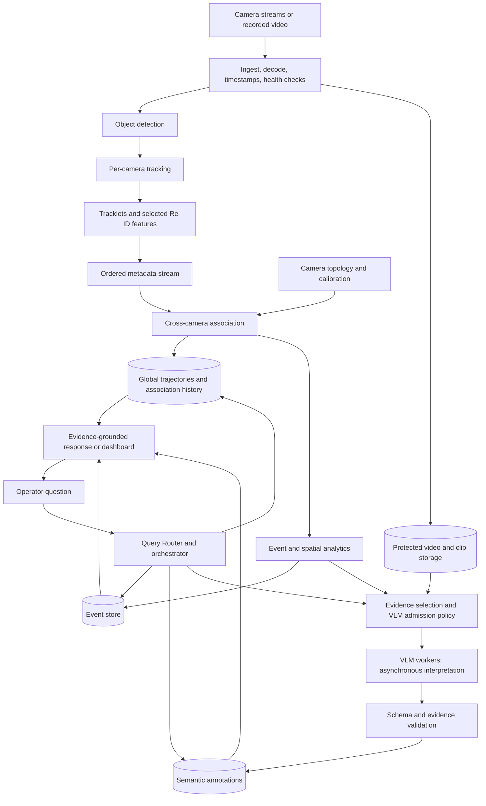
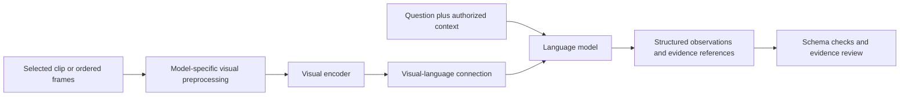

# VLM And Multi-Camera Multi-Object Tracking Architecture

A high-level blueprint for a computer vision system that tracks objects across cameras and uses a vision-language model to interpret selected visual evidence.

Companion guide: [MULTI_AGENT_SYSTEM_ARCHITECTURE.md](MULTI_AGENT_SYSTEM_ARCHITECTURE.md).

## 1. Recommended Starting Point

Build **a reliable tracking pipeline first, then add VLM-assisted understanding and an optional agent interface**. The tracking system should continue operating when the VLM is slow, unavailable, or uncertain.

Use three cooperating layers:

1. **Perception:** decode video, detect objects, and track them within each camera.
2. **Cross-camera analytics:** associate local tracks, maintain global trajectories, and compute events.
3. **Semantic understanding:** retrieve relevant footage, use a VLM to interpret it, and answer questions with evidence.

This is a proposed architecture for a new system, not documentation of a tracking implementation in this repository. It assumes fixed cameras at one site initially; moving cameras require additional pose estimation and motion compensation. Hardware, object classes, camera count, latency targets, and acceptable error rates must be chosen for the actual deployment.

## 2. Terminology

| Term | Meaning |
| --- | --- |
| Detection | A class and location estimate for an object in one frame |
| Single-camera MOT | Multi-object tracking: maintain object identities over time within one camera |
| Tracklet | A sequence of observations believed to belong to one object within a camera |
| Re-ID | Re-identification: an appearance embedding used to compare object observations |
| MTMC / MCMT | Multi-target/multi-camera or multi-camera/multi-object tracking: associate tracks across cameras |
| Global track ID | A system identifier linking associated observations across cameras, not a known personal identity |
| VLM | A vision-language model accepting visual inputs and language, typically producing text or structured answers |
| Event | A derived observation such as a zone entry, crossing, or dwell interval |

**Processing many camera streams is not automatically cross-camera tracking.** Even globally unique local IDs only prevent naming collisions. A separate association mechanism is needed to infer that two cameras observed the same object.

## 3. System Structure



Video is the high-bandwidth data path. Most services should exchange metadata and authorized media references, not repeated copies of full-resolution frames. Tracking, semantic processing, and interactive queries need separate resource limits and queues.

## 4. Per-Camera Perception

### Ingest And Time

Connect through a suitable video runtime such as GStreamer or FFmpeg. OpenCV is useful for prototypes and geometry, but production ingest also needs reconnection, decoding, buffering, and timestamp handling.

- Preserve capture time when available, media presentation timestamps, arrival time, camera ID, frame sequence, and stream epoch.
- Map source timestamps to a common timebase. Record estimated offset and uncertainty; do not assume timestamps from different devices are comparable.
- Use an appropriate clock synchronization method, such as NTP or PTP, and measure the achieved skew against the application's tolerance.
- Track dropped frames, frozen images, decode errors, clock discontinuities, and resolution changes.
- Increment a stream epoch after a reset that invalidates local numbering or tracker continuity.

Capture time is when something happened; arrival time is when the server received it. Network delay makes arrival time unreliable for cross-camera motion reasoning. Frame numbers alone are not a synchronization method.

### Detection

A typical detector applies preprocessing, a visual feature extractor, and prediction heads that produce boxes or masks, classes, and scores. Postprocessing depends on the model; some use non-maximum suppression and others do not.

Use an existing detector/runtime that fits the target classes and hardware. Validate on actual camera views before assuming a generic pretrained model recognizes site-specific objects. Preserve resizing and coordinate transforms so boxes can be mapped back to the original frames.

### Local Tracking

The tracker predicts object motion, associates current detections with existing tracks, updates matched tracks, and manages track birth, temporary loss, and termination. Typical ingredients are motion estimation, overlap or geometric distance, optional appearance features, and an assignment solver.

ByteTrack is a useful tracking-by-detection baseline: its association procedure can recover real objects from lower-score detections rather than simply discarding them. DeepStream trackers are an alternative when using a compatible NVIDIA deployment. These are starting points to benchmark, not universal winners.

Keep state isolated by camera and epoch, even when detection runs in shared batches. Trackers need ordered input and consistent elapsed-time handling. If frames are skipped, either use a tracker that handles the actual time delta or adapt and validate its motion model.

Choose detector frequency, tracker frequency, lost-track duration, and confirmation rules together. Lower detector frequency saves inference but can miss brief appearances and increase identity switches.

## 5. Cross-Camera Association

Local trackers produce observations. **The association service owns the decision to link those observations into a global trajectory.** A Re-ID vector database can retrieve candidates, but it is not the identity authority.

### Camera Topology And Geometry

Keep a camera registry with camera IDs, site, image size, zones, overlapping views, plausible transitions, expected travel-time ranges, calibration version, and health status.

There are two different association cases:

| Camera relationship | Useful evidence | Main constraint |
| --- | --- | --- |
| Overlapping views | Synchronized observations, calibrated location, appearance | One object may legitimately appear in several cameras at the same time |
| Non-overlapping views | Exit/entry zones, feasible travel time, appearance history | An object is unobserved during the gap; continuity remains uncertain |

For an approximately planar floor, a calibrated homography can map a suitable ground-contact point into site coordinates. It does not map an arbitrary elevated box center to a correct floor position. Account for lens distortion and coordinate transforms. Nonplanar geometry or true 3D fusion requires an appropriate calibrated multi-view/depth approach.

Recalibrate or invalidate geometry after a camera moves, zooms, or changes resolution. Record units, coordinate frame, and location uncertainty. Bad calibration can make appearance-based matches look physically valid when they are not.

### Association Procedure

1. Assemble quality-filtered tracklet summaries: time interval, path, zones, class, and several representative appearance features.
2. Generate candidates only within the same permitted site and plausible camera/time neighborhood.
3. Reject physically impossible matches using topology, time uncertainty, geometry, and compatible object classes.
4. Score remaining candidates using appearance similarity and applicable spatiotemporal evidence.
5. Resolve competing matches with a constrained assignment or graph method rather than independent nearest-neighbor decisions.
6. Accept, defer, or leave unmatched. Do not force every track into an existing identity.
7. Publish versioned association decisions and retain the evidence needed to revise a mistaken merge or split.

A Hungarian assignment is useful for a suitable pairwise matching problem; broader multi-camera consistency may require a graph formulation. Do not impose a rule that prohibits simultaneous observations across overlapping cameras. At the same time, prevent one global track from occupying mutually incompatible locations.

Use class/domain-appropriate Re-ID models. A person Re-ID model is not automatically suitable for forklifts, pallets, or products. Similar-looking objects, uniforms, occlusion, and camera color differences can make appearance ambiguous. When reliable instance identity is essential, assess complementary tags or other sensors rather than expecting visual similarity to resolve indistinguishable objects.

Separate **online, provisional association** from **offline reconciliation**. Later evidence can improve a trajectory, but corrections must be versioned and propagated to affected events and counts instead of silently changing history.

## 6. Data Contracts And Storage

Define versioned messages before splitting the system into services. A local observation can look like this:

```json
{
  "schema_version": "1",
  "event_id": "obs-cam-07-epoch-12-frame-98122-track-42",
  "site_id": "warehouse-a",
  "camera_id": "cam-07",
  "stream_epoch": "epoch-12",
  "frame_id": 98122,
  "captured_at_utc": "2026-10-01T08:15:20.120Z",
  "received_at_utc": "2026-10-01T08:15:20.240Z",
  "timestamp_uncertainty_ms": 20,
  "local_track_id": "42",
  "global_track_id": null,
  "class_name": "forklift",
  "bbox_xyxy_pixels": [420, 210, 720, 690],
  "image_size_wh": [1920, 1080],
  "detection_score": 0.94,
  "observation_kind": "detected",
  "world_position_m": null,
  "calibration_version": null,
  "reid_model_version": "forklift-reid-v1",
  "embedding_ref": "feature-7301",
  "media_ref": "clip-5841"
}
```

Scores are model-specific, not automatically calibrated probabilities. A predicted position during occlusion must be labeled as predicted, not presented as a fresh visual observation. A local key should include site, camera, epoch, and local ID to prevent collisions after restarts.

| Store | Purpose |
| --- | --- |
| Camera registry | Topology, calibration, zones, configuration versions |
| Stream buffer or broker | Ordered metadata delivery, bounded retention, replay offsets |
| Track state | Active local/global state and durable association decisions |
| Trajectory/event database | Historical queries, counts, dwell intervals, revisions |
| Feature index | Candidate retrieval over bounded Re-ID galleries |
| Media storage | Short rolling buffer and retained clips under access/retention policy |
| Semantic index | Searchable descriptions with media timestamps and track references |

Partition metadata by camera for local ordering, then by site or association region for global processing. Use event IDs to deduplicate redelivery. Decide how late data is handled, including a bounded event-time buffer and whether results are provisional or finalized. For small deployments, in-process channels and a database may suffice; a distributed broker is not mandatory.

Do not mix embeddings from incompatible model versions. Keep original observations distinct from derived global-ID mappings, so association corrections do not destroy the input evidence.

## 7. VLM Structure And Role

A typical VLM consists of a visual encoder, a mechanism that connects visual features to a language model, and a language decoder that produces an answer. Depending on the architecture, that connection may use a projector, cross-attention, or other multimodal fusion. Video-capable models also need a way to represent multiple frames and temporal information.



Not every image-capable model supports video or reliably understands motion. Verify the selected model's input formats, frame limits, temporal behavior, resolution requirements, deployment terms, and performance on the actual tasks.

### Appropriate Responsibilities

| Use the VLM for | Keep in CV, analytics, or application code |
| --- | --- |
| Describing visible activity in a selected clip | Maintaining authoritative track identities |
| Answering a visual question with timestamped evidence | Clock synchronization and camera calibration |
| Suggesting semantic labels for retrieval | Exact counts and durations from track/event records |
| Reviewing a candidate event for additional context | Enforcing access, retention, approvals, and safety rules |
| Summarizing an evidence-backed sequence | Determining physical distance from uncalibrated images |

For a frequent, tightly defined visual task, a specialized classifier or action-recognition model may be cheaper and easier to validate than a general VLM. Use the VLM where flexible language-driven interpretation adds value.

### Evidence Selection And Grounding

1. Trigger semantic analysis from a candidate event, an operator question, or a bounded sampling policy.
2. Retrieve the relevant camera/time interval and add pre-event and post-event context where available.
3. Supply ordered frames or a clip, timestamps, relevant track annotations, and the precise question.
4. Preserve enough surrounding scene context; a tight crop may hide the cause or interaction being assessed.
5. Request observations, evidence references, and an explicit insufficient-evidence outcome.
6. Validate output structure and reference existence, then evaluate whether the cited imagery actually supports the claims.

Schema validation proves format, not visual truth. Distinguish model interpretation from measured events. Treat OCR text and instructions visible in video as untrusted content, never as permission to execute commands.

Sampling can miss short actions. A VLM that sees a few frames cannot establish that an event never occurred between them. Report the observed interval, sampling policy, and coverage gaps. Do not convert "not visible" into "did not happen".

## 8. Router And Orchestration

Use deterministic stream processing for the high-frequency pipeline. A camera worker is usually a service or process, **not an LLM agent**. Do not create one conversational agent per camera or object.

An optional natural-language interface can use the multi-agent architecture in the companion guide:

| Request or trigger | Route | Expected evidence |
| --- | --- | --- |
| "How many forklifts crossed zone A?" | Analytics specialist | Versioned crossing records and coverage status |
| "Where did tracked object 104 go?" | Trajectory specialist | Authorized global associations and timestamped observations |
| "What happened around this stop?" | Video interpretation specialist | Selected clips, track context, VLM observations |
| "Summarize congestion this shift" | Orchestrated analytics and selected video review | Aggregates, representative clips, uncertainty |
| Camera stopped publishing | Operational monitor, normally rule-based | Health telemetry and approved recovery policy |

The **query Router** chooses the capability. The **evidence selector** chooses cameras, time ranges, and media. The **resource scheduler** admits GPU work according to priority and budgets. These are separate decisions, even if initially implemented in one service.

Use a task graph for dependencies: fetch events, select clips, analyze independent clips in parallel, then compose a report. Keep tool outputs structured and references scoped to the authenticated user. Initially, the agent layer can simply expose read-only tools for trajectories, events, and clips.

Cache semantic results by media identity, time range, model/prompt version, and relevant query settings. Include authorization scope where necessary; never let caching bypass access controls.

## 9. Runtime And Scaling

Deploy video decode, detection, and local tracking near the camera streams when bandwidth or privacy favors edge processing. Centralize site-level association and historical queries where practical. Host VLM workers separately, or enforce resource reservations so they cannot starve tracking on shared hardware.

- Batch compatible inference requests with a maximum wait time; do not wait indefinitely for a disconnected camera.
- Keep one effective owner of each local tracker state. Stateless frame-level load balancing can scramble its history.
- Scale detection by measured throughput and local tracking by assigned streams; scale global association by feasible regions while handling cross-region handoffs.
- Use bounded queues and monitor **frame age**, not just frames per second.
- For live monitoring, use a documented stale-frame policy when overloaded. For forensic processing, preserve footage and process more slowly instead of silently dropping evidence.
- Limit Re-ID extraction to useful observations and expire galleries. Bound candidate matching by topology and time rather than comparing all historical tracks.
- Limit VLM clips, frames, visual tokens, concurrency, and request duration separately from CV budgets.

For capacity planning, detector demand is approximately camera count multiplied by detector frames per second. For example, 12 cameras at 10 detector FPS require 120 detector frames per second **before** allowing for decode, tracking, Re-ID, association, storage, and headroom. This is a workload calculation, not a hardware benchmark.

Measure end-to-end p95/p99 latency under peak object density and simultaneous VLM load. Report tracking latency, global-association delay, and semantic-answer latency separately; they have different service-level targets.

## 10. Failure Handling And Governance

| Failure or uncertainty | Required behavior |
| --- | --- |
| Camera outage or frozen feed | Mark coverage unavailable; do not interpret missing data as zero activity |
| Clock drift or reset | Flag degraded time quality and restrict associations that need precise timing |
| Occlusion or appearance ambiguity | Keep unmatched/provisional tracks rather than fabricate certainty |
| Camera moved or calibration invalid | Disable affected geometry-dependent reasoning until revalidated |
| VLM timeout or overload | Continue tracking; defer or omit semantic enrichment explicitly |
| Bad global-ID merge | Issue a versioned correction and recompute affected derived results |
| Duplicate events or worker restart | Deduplicate, restore state where supported, or begin a documented new epoch |
| Incompatible model update | Separate feature versions and validate before promotion |

Restrict access to live streams, archived video, embeddings, trajectories, and exports. Use encryption, audit logs, minimum necessary retention, and authorized deployment locations. Where people are captured, assess legal basis, notice, proportionality, and privacy controls; pseudonymous IDs and appearance embeddings are not automatically anonymous data.

Keep consequential operational actions behind validated rules and appropriate human oversight. A VLM interpretation is not a safety-certified control signal. Review candidate-event verification for false negatives as well as false positives; a VLM should not silently suppress a critical alert.

## 11. Evaluation

Build a representative, authorized labeled dataset with synchronized multi-camera footage, local tracks, cross-camera identities, and target events. Separate training, tuning, and final testing by meaningful units such as recording session, day, or site; adjacent frames from one clip are not independent test data.

| Layer | Useful metrics |
| --- | --- |
| Detection | Precision/recall and mAP by class, camera, lighting, and object size |
| Local tracking | HOTA, IDF1, identity switches, fragmentation, lost-track recovery |
| Cross-camera tracking | Global identity consistency, association precision/recall, false merges/splits, handoff accuracy |
| Spatial analytics | Position error on surveyed points, count error, dwell-time error, event precision/recall |
| VLM | Supported-claim rate, task accuracy, evidence alignment, appropriate abstention, missed short events |
| Operations | Frame age, queue depth, throughput, GPU memory, uptime, cost per camera-hour |

HOTA measures complementary aspects of detection and association; IDF1 measures identity preservation. Neither a good detector score nor good per-camera tracking proves cross-camera identity quality. Global evaluation requires cross-camera ground truth and an explicit joint evaluation protocol; specify how simultaneous views and time alignment are scored.

Test crossings, heavy occlusion, similar-looking objects, re-entry, long gaps, overlapping views, night/day changes, clock skew, camera restarts, and peak load. Measure unique-object counts separately from per-camera sightings and define whether repeated crossings should count again.

Compare CV-only events with CV-plus-VLM enrichment on the same held-out data. Keep the added VLM step only where its benefit justifies latency, cost, and any new error modes.

## 12. Efficient Build Order

1. Define target classes, site/camera topology, privacy constraints, identity horizon, and latency/error budgets.
2. Collect representative recordings and build an evaluation/replay harness.
3. Establish a single-camera detector and tracker baseline using existing libraries.
4. Add reliable multi-stream ingest, timestamp normalization, epochs, and health monitoring.
5. Establish camera topology and calibrate only the geometry-dependent functions you need.
6. Implement conservative cross-camera association for a small camera group; inspect failed handoffs before scaling.
7. Persist observations, association history, events, and authorized clip references.
8. Implement useful deterministic analytics such as zone crossings and dwell intervals.
9. Add one bounded VLM use case, such as describing clips around candidate stops; evaluate it independently.
10. Add the Router and read-only agent tools only when natural-language workflows are useful.
11. Test degraded modes, privacy boundaries, load, and restart/replay behavior.
12. Expand camera count and object classes with versioned models, staged rollout, and rollback.

A useful first milestone is two cameras, one object class, one cross-camera transition, one event type, and one evidence-backed visual question. Do not begin with an unrestricted autonomous video agent.

## 13. Technology Choices

| Need | Candidate starting point | Decision factor |
| --- | --- | --- |
| Video runtime | GStreamer / FFmpeg; DeepStream on supported NVIDIA platforms | Decode throughput, reconnect behavior, hardware support |
| Geometry | OpenCV calibration and projection utilities | Actual camera model, distortion, coordinate convention |
| Detector and local tracker | Existing detector plus ByteTrack, or a supported integrated tracker | Accuracy on target views, runtime compatibility, licensing |
| Inference | ONNX Runtime, OpenVINO, or TensorRT where supported | Target hardware and measured exported-model accuracy |
| Metadata transport | In-process channels first; durable broker when justified | Replay, ordering, throughput, operational cost |
| Persistence | Transactional database plus media/object storage | Query shape, retention, correction history |
| VLM layer | Hosted approved VLM or self-hosted video-capable model | Data policy, hardware, temporal accuracy, latency |
| Agent interface | Existing application stack and bounded workflow runtime | Reuse of authentication, tools, state, and observability |

Reuse tested tracking and inference implementations rather than writing those algorithms from scratch. Pin releases and verify code, model-weight, and dataset licenses separately. This Windows-hosted application's API can remain separate from Linux/GPU vision workers; verify the supported deployment matrix rather than assuming native Windows support for a vendor video stack.

## 14. Sources

Researched on 2026-10-01. These references support the design principles and candidate components; their benchmark results do not predict performance on a new site. Some are vendor-specific examples, not required dependencies.

- [NVIDIA DeepStream: Gst-nvtracker](https://docs.nvidia.com/metropolis/deepstream/dev-guide/text/DS_plugin_gst-nvtracker.html): tracker components, multi-stream operation, state management, Re-ID features, geometry, and accuracy/performance tradeoffs.
- [ByteTrack paper](https://arxiv.org/abs/2110.06864): association of high- and lower-score detections as a practical MOT baseline.
- [HOTA paper](https://arxiv.org/abs/2009.07736): balanced evaluation of detection, localization, and association quality.
- [NVIDIA Video Search and Summarization blueprint](https://github.com/NVIDIA-AI-Blueprints/video-search-and-summarization): separation of real-time video intelligence, downstream analytics, and agent/offline processing; examples of VLM-assisted verification, search, and summarization. Use a reviewed release rather than tracking a moving development branch.

The cross-camera decision rules, storage boundaries, and staged rollout here are architecture recommendations. Benchmark and adapt them to the site's geometry, object classes, camera quality, and acceptable uncertainty before treating the system as production-ready.